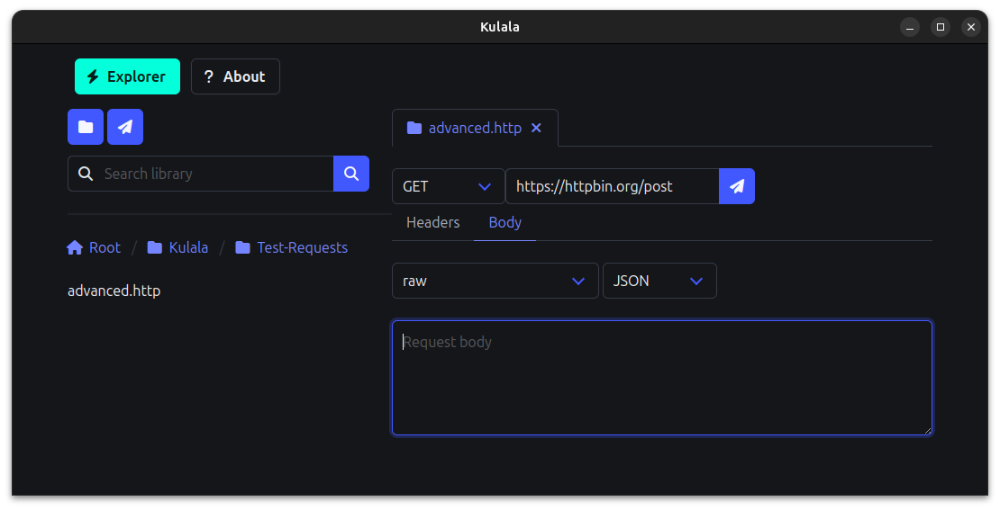

# Kulala

[Install](#install) • [Website](https://kulala.mwco.app/) • [Tutorial](https://kulala.mwco.app/tutorial) • [Privacy Policy](./PRIVACY.md) • [Terms of Service](./TOS.md) • [Code of Conduct](./CODE_OF_CONDUCT.md)

A minimal REST-Client GUI for Mac, Linux and Windows.

Kulala is swahili for "rest" or "relax".

It allows you to make HTTP requests via `.http` files.

No login 🌈, no tracking 🕵️‍♀️, No Ads 🔥, no BS 💩.

## 🚧 Under Heavy Development

🚀 **Kulala is currently in active development and not yet available as an official public release.**

While we are working hard to bring it to production,
expect frequent changes and improvements.

Stay tuned for updates!

Kulala is inspired by [Kulala.nvim](https://github.com/mistweaverco/kulala.nvim),
its spiritual predecessor.

If you're interested in a Neovim-based REST client, check it out!

## Install

Once released, you will be able to grab the latest version from the
[GitHub releases page](https://github.com/mistweaverco/kulala/releases/latest)
or from the [website](https://kulala.mwco.app/downloads).
